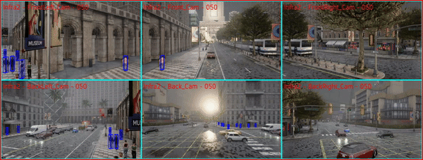

# CVIPS: Connected Vision for Increased Pedestrian Safety
Implementation of the CVIPS project.
- [X] Dataset
- [X] CARLA data generation code


## Dataset
The CVIPS dataset is available [here](https://drive.google.com/drive/folders/1gCCrIslzVkupyF0lj_1I9qXTB2_a4tjd?usp=drive_link).


## Installation
Please check [installation](https://carla.readthedocs.io/en/0.9.14/build_windows) on how to setup CARLA for windows


## Dataset Generation
Our dataset is generated using the CARLA simulator, providing diverse scenarios for collaborative perception.

### Running the Data Generation Script

1. Clone the repository:
   ```
   git clone https://github.com/cvips/CVIPS.git
   cd CVIPS
   ```

2. Install the required dependencies:
   ```
   pip install -r requirements.txt
   ```

3. Ensure CARLA is properly installed and running. Start the CARLA server in a separate terminal:
   ```
   /path/to/carla/CarlaUE4.exe
   ```

4. Run the data generation script:
   ```
   python cvips_generation.py
   ```

   This script will connect to the CARLA server and generate the dataset based on the specified parameters.

Note: Make sure to adjust the CARLA server path and any configuration parameters in `cvips_generation.py` as needed for your specific setup.

### Sample Examples

Here are some example commands to generate different scenarios:

1. Four-way intersection in Town10HD with clear weather at noon:
   ```
   python cvips_generation.py --town Town10HD --intersection 4way --setup wsee --weather clear --time_of_the_day noon --crowd_level medium --crossing_percentage 0.1 --seed_value 23 --scenario scenario00001
   ```

2. Four-way intersection in Town04 with rainy weather at sunset:
   ```
   python cvips_generation.py --town Town04 --intersection 4way --setup wwss --weather rainy --time_of_the_day sunset --crowd_level medium --crossing_percentage 0.1 --seed_value 42 --scenario scenario00002
   ```

3. Three-way intersection in Town05 with clear weather at night:
   ```
   python cvips_generation.py --town Town05 --intersection 3way --setup wwss --weather clear --time_of_the_day night --crowd_level medium --crossing_percentage 0.1 --seed_value 73 --scenario scenario00005
   ```

4. Four-way intersection in Town10HD with cloudy weather at noon:
   ```
   python cvips_generation.py --town Town10HD --intersection 4way --setup wwws --weather cloudy --time_of_the_day noon --crowd_level medium --crossing_percentage 0.1 --seed_value 101 --scenario scenario00011
   ```

These examples demonstrate various combinations of towns, intersection types, weather conditions, times of day, and camera setups. Users can modify these parameters to generate different scenarios as needed.

### Sample Visualizations

We provide visualizations to demonstrate different perspectives in our dataset:
(this can be done using [Code/data_viz.py](Code\data_viz.py))
1. **Infrastructure View** (6 cameras)
   
   This visualization shows the scene from fixed infrastructure cameras, providing a comprehensive view of the intersection from multiple angles.

2. **Vehicle View** (6 cameras)
   
   This visualization demonstrates the perspective from a moving vehicle, showcasing the view from various angles around the vehicle.

3. **Collaborative View** (4 cameras)
   
   This visualization combines views from both vehicles and infrastructure, illustrating the collaborative perception aspect of our dataset.


- Multiple camera perspectives (infrastructure, vehicle-mounted, and collaborative)
- Various weather conditions and times of day ()
- Diverse traffic scenarios with multiple vehicles and pedestrians setup (controlled by seeds, number of pedestrians, number of vehicles to be spawned)


## For Detection in collaborative setup check the documentation of V2XFormer
First, prepare the dataset with this format [data_preparation](docs/data_preparation.md) .
Then, use [V2XFormer](https://github.com/tianqi-wang1996/DeepAccident) according to the instructions here 
1. [Installation](https://github.com/tianqi-wang1996/DeepAccident/blob/main/docs/installation.md)
2. [Training and Evaluation](https://github.com/tianqi-wang1996/DeepAccident/blob/main/docs/getting_started.md) -- adjust the datapaths and number of classes accordingly

## Acknowledgement
This project is based on the following open-source projects: [BEVerse](https://github.com/zhangyp15/BEVerse), [Fiery](https://github.com/wayveai/fiery), [open-mmlab](https://github.com/open-mmlab), and [DeepAccident](https://arxiv.org/pdf/2304.01168).

## Citation


```
